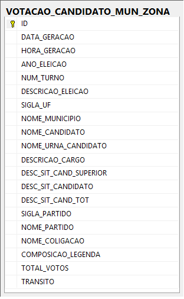

# Modelagem do Banco de Dados #

Para melhorar a organização dos dados, alguns bancos de dados conhecidos como "STAGES" foram implementados.

#### DM_STAGE_1 ####

Criado com apenas uma tabela denominada "VOTACAO_CANDIDATO_MUN_ZONA", este banco tem como objetivo representar fielmente a estrutura e armazenar os dados retirados do [Repositório de Dados Eleitorais - TSE - Tribunal Superior Eleitoral](http://www.tse.jus.br/hotSites/pesquisas-eleitorais/index.html) em arquivos de formato ".txt".

<strong>Representação Física do Banco:</strong>

Faça aqui <strong>[Download](https://github.com/mateusblopes/fazendo-bi-do-zero/tree/master/3.%20Execucao/3.2.%20Modelagem/scripts/Criando%20DM_STAGE_1.sql)</strong> do script de criação da tabela "VOTACAO_CANDIDATO_MUN_ZONA" do "DM_STAGE_1"

#### DM_STAGE_2 ####

Criado com apenas uma tabela resumida denominada "VOTACAO_CANDIDATO_MUN_ZONA", este banco tem como objetivo representar de forma suscinta e facilitar a criação de dashboards por conter apenas os dados que são relevantes para a criação do mesmo.

<strong>Representação Física do Banco:</strong>

Faça aqui [Download](https://github.com/mateusblopes/fazendo-bi-do-zero/tree/master/3.%20Execucao/3.2.%20Modelagem/scripts/Criando%20DM_STAGE_2.sql) do script de criação da tabela "VOTACAO_CANDIDATO_MUN_ZONA" do "DM_STAGE_2"

#### DM_ELEICOES ####

Criado baseada na modelagem dimensional de dados, constituido por cinco tabelas "DIM_DATA", "DIM_ELEICAO", "DIM_PARTIDOS", "DIM_CANDIDATO" e "FATO_APURACAO_ELEICOES", este banco tem como objetivo representar de forma suscinta para facilitar a criação de dashboards conforme as visões pré-estabelecidas.

<strong>Representação Física do Banco:</strong>

Faça aqui [Download](https://github.com/mateusblopes/fazendo-bi-do-zero/tree/master/3.%20Execucao/3.2.%20Modelagem/scripts/Criando%20DM_ELEICOES.sql) do script de criação do banco de dados "DM_ELEICOES"